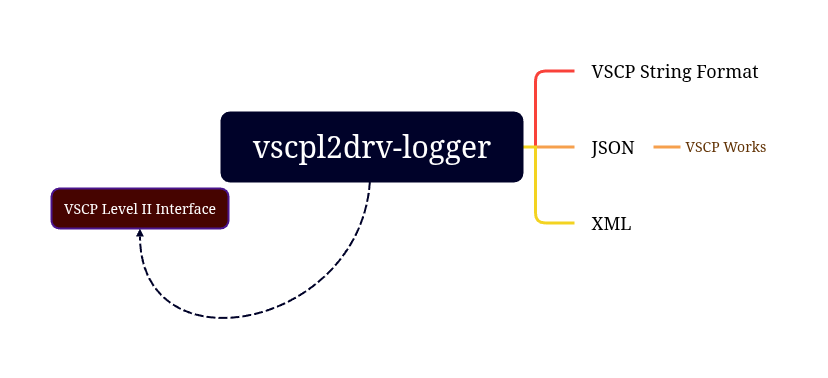

# vscpl1drv-logger

- **Available for**: Linux, Windows, MacOS
- **Driver Linux**: vscpl2drv-logger.so
- **Driver Windows**: vscpl2drv-logger.dll
- **Driver MacOS**: libvscpl2drv-logger.dylib
  

# Introduction
VSCP level II driver for diagnostic logging. It makes it possible to log VSCP events from a source to a file. Three formats of the log file is currently supported. Either a standard text string i logged for for each event or logging entries can be logged on XML or JSON format. The advantage of the later is that it can be read by VSCP works and further analyzed there. Several drivers can be used to write logging data to different output files and using different filter/masks for complex logging.

* Documentation is available [here](https://grodansparadis.github.io/vscpl2drv-logger)
* Repository for the module is [here](https://github.com/grodansparadis/vscpl2drv-logger)

The level II driver API is [described here](https://grodansparadis.github.io/vscp-doc-spec/#/./vscp_driver_interfaces). With the simple interface API the VSCP level II driver uses (described above) it is also easy to use it with other software as a component.

## Other sources of information

 * The VSCP site - https://www.vscp.org
 * The VSCP document site - https://docs.vscp.org/
 * VSCP discussions - https://github.com/grodansparadis/vscp/discussions
