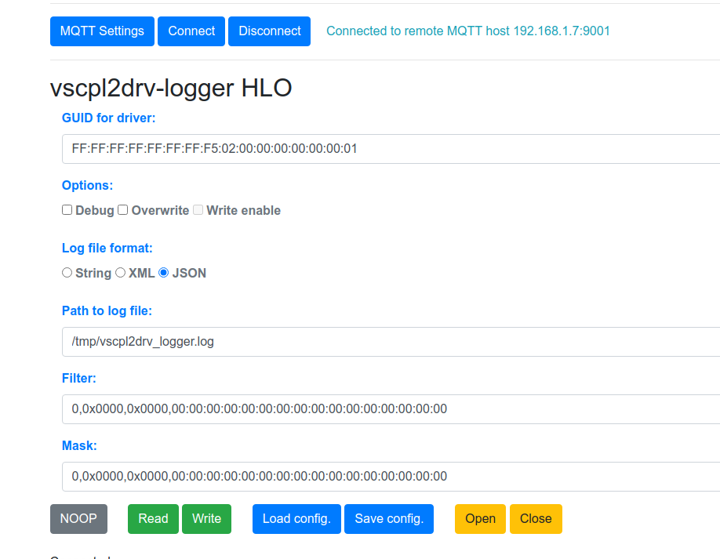

This driver can be configured using High Level Object configuration. This is a web-based configuration interface that all VSCP level II drivers support.

The files needed for HLO configuration this not automatically installed at the moment but if you want to test HLO configuration just copy the files in the [forms folder](https://github.com/grodansparadis/vscpl2drv-logger) to you own disk and open the index.html file to test it.