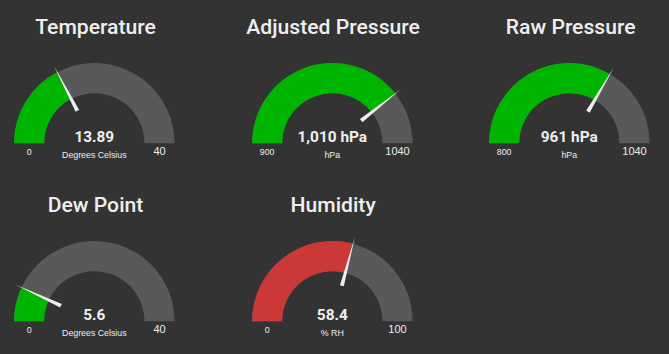

A typical use of vscpl2drv-logger is when you want to log data from a VSCP node or a range of nodes on a VSCP network. Normally you do this for debugging purposes or to monitor the network for certain events.

## Make your own application that interface the level II driver

It is very easy to interface VSCP Level II drivers from other software. Full information about the interface is [here](https://grodansparadis.github.io/vscp/#/level_ii_drivers)

Easiest is of course to link to the driver shared library from your own application. You can also load the driver manually at runtime if you want to be able to load different drivers without recompiling your application. The interface header is available [here](https://github.com/grodansparadis/vscp/blob/master/src/vscp/common/level2drvdef.h)

For manual linking there is a simple test application that can be used to test the websocket driver (or all level II drivers). The application is available in the [testapp](https://github.com/grodansparadis/vscpl2drv-logger/tree/master/testapp) of the project.

This driver have hard coded configuration paths so you need to edit it before use. You find them in the beginning of the file.

The `testapp` loads and finds the methods of the driver manually so it is a good example of how to interface level II drivers from your own software. It will send a VSCP event every second and print any received events to the console. It should work on all supported platforms.

## Setting up your own VSCP Daemon for testing on Linux

Download and install the VSCP Daemon if you don't have it already. See [here](https://grodansparadis.github.io/vscp/#/) for information on how to do this.

Add the following to the level II section of the VSCP daemon configuration file

``` json
{
  "enable" : true,
  "name" : "logger-srv",
  "path-driver" : "/var/lib/vscp/drivers/level2/libvscpl2drv-logger.so",
  "path-config" : "/etc/vscp/logger.json",
  "guid" : "FF:FF:FF:FF:FF:FF:FF:F5:02:88:88:00:00:00:00:02",

  "mqtt": {
    "bind": "",
    "host": "test.mosquitto.org",
    "port": 1883,
    "mqtt-options": {
      "tcp-nodelay": true,
      "protocol-version": 311,
      "receive-maximum": 20,
      "send-maximum": 20,
      "ssl-ctx-with-defaults": 0,
      "tls-ocsp-required": 0,
      "tls-use-os-certs": 0
    },
    "user": "vscp",
    "password": "secret",
    "clientid": "the-vscp-daemon logger driver",
    "publish-format": "json",
    "subscribe-format": "auto",
    "qos": 1,
    "bcleansession": false,
    "bretain": false,
    "keepalive": 60,
    "bjsonmeasurementblock": true,
    "reconnect": {
      "delay": 2,
      "delay-max": 10,
      "exponential-backoff": false
    },
    "tls": {
      "cafile": "",
      "capath": "",
      "certfile": "",
      "keyfile": "",
      "pwkeyfile": "",
      "no-hostname-checking": true,
      "cert-reqs": 0,
      "version": "",
      "ciphers": "",
      "psk": "",
      "psk-identity": ""
    },
    "will": {
      "topic": "vscp-daemon/{{srvguid}}/will",
      "qos": 1,
      "retain": true,
      "payload": "VSCP Daemon is down"
    },
    "subscribe" : [
      {
        "topic": "vscp/logger/{{guid}}/#",
        "qos": 0,
        "v5-options": 0,
        "format": "auto"
      }
    ]
  }
}
```

Copy _/var/share/vscpl2drv-logger/logger.json_ and _/var/share/vscpl2drv-logger/users.json_ to _/etc/vscp_

```bash
sudo cp /var/share/vscpl2drv-logger/logger.json /etc/vscp
sudo cp /var/share/vscpl2drv-logger/users.json /etc/vscp
```

Restart the vscp daemon

```bash
sudo systemctl restart vscpd
```


[filename](./bottom-copyright.md ':include')